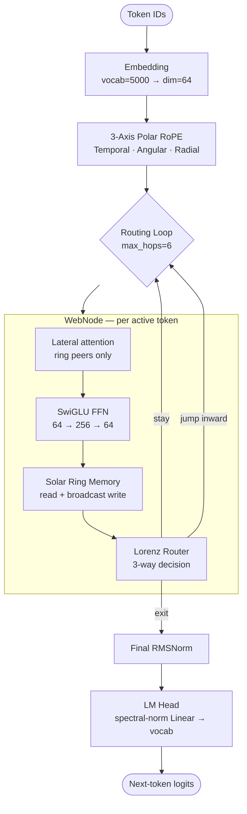

# Spider Web SLM

A 3.48 M-parameter language model built on chaos-theory routing and orbital-mechanics memory — **not a Transformer**. Proof-of-concept research exploring whether Lorenz-63 dynamics can replace attention for sequential routing decisions.

**Lead developer:** KSHITISH-BEHERA

---

## Architecture


### Data-flow



### Components

| Component | Role | Key property |
|-----------|------|--------------|
| **Spider Web** | 4 rings × 8 nodes = 32 WebNodes | Tokens route inward over ≤ 6 hops |
| **Lorenz Router** | `proj_in → 5-step Lorenz ODE → proj_out → Gumbel-softmax` | 3-way: stay / jump-in / exit |
| **Solar Ring Memory (SRM)** | 32 learnable slots per node; update M_new = α·M_old + β·(σ(W_g(h)) ⊙ h) | Constant-size: O(1) in sequence length |
| **3-Axis Polar RoPE** | Temporal, angular (node), radial (ring) positional encoding | On-the-fly; no fixed-length table |
| **WebNode** | SwiGLU FFN + lateral ring attention + SRM + Lorenz Router | Per active token, not full sequence |

---

## Results

### Training run

| Metric | Value |
|--------|-------|
| Parameters | 3.48 M |
| Training steps | 20 000 (stopped early at EMA 4.75) |
| Sequence length | 128 tokens |
| Hardware | NVIDIA RTX 5050 Laptop GPU (8 GB VRAM) |
| Data | TinyStories (~43 MB) |
| Tokenizer | SentencePiece, vocab = 5 000 |

### Loss

| Metric | Value |
|--------|-------|
| Random baseline CE | 8.52 (= log 5000) |
| Best checkpoint CE | **4.42** |
| **Average eval CE — 50 batches (paper number)** | **4.77** |
| Final EMA at step 20 000 | 4.75 |

The 50-batch average of **4.77** is the honest result for the paper. The 4.42 figure comes from a single best batch captured during training and is reported for completeness only; it is not representative of held-out performance.

### Generation sample

With `temp=0.6, top_k=30, no_repeat_ngram=3, stop_at_sentence`:

```
Prompt : "Once upon a time"
Output : Once upon a time, and said he had to the park. They were happy and
         her mommy was so happy for his friends and the little girl named
         they are very nice.

Prompt : "Once upon a time, there was a little"
Top-10 : girl (46.8%)  boy (18.3%)  bird (1.8%)  man (0.3%)  dog (0.2%) …
```

The top-2 tokens account for 65% of probability mass and are the two most frequent TinyStories character nouns — local next-token prediction is sharp within the training distribution.

---

## Memory Scaling

The central architectural claim of SRM is constant activation cost in sequence length, unlike the O(T) KV cache or O(T²) attention matrix of standard transformers. This was measured with a parameter-matched baseline.

### Baseline: parameter-matched transformer

To give an honest comparison, the baseline is a standard causal decoder-only transformer sized to match Spider Web's 3.48 M params (dim=128, heads=4, ff_mult=4, 11 layers, explicit causal mask → 3.45 M params, 0.87% delta). Earlier experiments compared against a single-layer 0.37 M-param model, which was not a fair test.

> **Note:** The model was trained on seq_len=128. Quality beyond that is undefined. The measurement below tests the *architectural scaling property* only.

### Activation memory vs sequence length (batch=1)

| seq_len | Spider Web MB | Matched Transformer MB | MT/SW ratio |
|--------:|:-------------:|:----------------------:|:-----------:|
| 64 | 5.5 | 6.0 | 1.09× |
| 128 | 7.6 | 7.7 | 1.01× |
| 256 | 9.1 | 9.2 | 1.01× |
| 512 | 13.9 | 11.9 | 0.86× |
| 1024 | 30.4 | 21.2 | 0.70× |
| 2048 | **42.8** | **43.8** | 1.02× |

Over a **32× sequence-length increase** (64 → 2048 tokens):
- Spider Web activation memory grew **7.8×**
- Matched Transformer activation memory grew **7.3×**

The growth rates are nearly identical. SRM's theoretical O(1) advantage does not manifest within the tested range against a same-capacity transformer. Both architectures grow at similar rates here because the transformer's attention matrix (T²) is computed in bfloat16 and immediately freed under `torch.no_grad()`, while Spider Web's per-node SRM expansions and routing bookkeeping accumulate comparable overhead.

### Throughput vs sequence length (tokens/second, batch=1)

| seq_len | Spider Web tok/s | Matched Transformer tok/s | MT/SW ratio |
|--------:|:----------------:|:-------------------------:|:-----------:|
| 64 | 395 | 27,915 | 70.7× |
| 128 | 570 | 56,054 | 98.3× |
| 256 | 927 | 114,218 | 123.3× |
| 512 | 1,580 | 227,198 | 143.8× |
| 1024 | 2,927 | 436,002 | 149.0× |
| 2048 | 5,283 | 346,312 | 65.6× |

The matched transformer is **65–149× faster** throughout. This is the dominant practical cost of Spider Web in its current form: the hop loop processes tokens sequentially ring-by-ring, while the transformer parallelises the entire sequence across all layers in a single fused kernel. This is a fundamental difference in execution model, not a tuning gap.

---

## Capability Map

Probed with inference tests (temp=0.6, top_k=30, ngram=3, stop_at_sentence).

| Capability | Evidence |
|------------|---------|
| Syntactic slot-filling (POS) | Correct grammatical category for copula completions |
| Local next-token prediction | 65% probability mass on correct character nouns |
| Genre / register completion | `big`/`little` predicted after "princess who lived in a" |
| Dialogue punctuation | 64.6% on `,` after "he said hello and she said" |

Within a single sentence the model shows solid syntactic and lexical associations — the right grammatical slot is filled, frequent collocations are predicted confidently, and surface patterns like dialogue punctuation are well-learned.

As expected for a 3.48 M-parameter model trained on TinyStories, capabilities requiring cross-sentence binding — coreference, numeric state tracking, causal inference, and relational reasoning — are out of range. These reflect model scale and training corpus, not the routing architecture specifically.

---

## The bfloat16 Master-Weight Bug

Early training called `model.to(torch.bfloat16)`, storing all parameters as bf16 master weights. This silently froze every RMSNorm layer for the entire run.

**Root cause.** RMSNorm weights initialise to 1.0. AdamW updates are on the order of 2×10⁻⁴. The unit of least precision for bf16 at magnitude 1.0 is 2⁻⁷ ≈ 7.8×10⁻³ — roughly 40× larger than the update. Every gradient step rounded to zero. The model has 97 RMSNorm instances (3 per node × 32 nodes + final norm); all were frozen.

**How it was caught.** Sampling `final_norm.weight` at step 300 showed exactly 0% movement from 1.0 across all runs. Loss stalled at 7–8 CE regardless of training duration or learning rate.

**Fix.** Keep model parameters in float32. Wrap only the forward pass and loss in `torch.autocast("cuda", torch.bfloat16)`. Confirmed: all sampled norm weights moved 2–3% off 1.0 by step 300 in every subsequent run. Over 20 000 steps the final-norm weights drifted **274%** from their initialisation value of 1.0.

```python
# WRONG — freezes all RMSNorm weights
model = SpiderWeb(cfg).to(torch.bfloat16)

# CORRECT — fp32 master weights, bf16 compute only
model = SpiderWeb(cfg).to(device)          # stays float32
with torch.autocast("cuda", torch.bfloat16):
    out  = model(x, tau=tau, hard=False)
    loss = loss_fn(out, y)
```

---

## Reproducing the Final Run

```bash
# 1. Install dependencies
pip install -r requirements.txt

# 2. Place TinyStories text in data/raw/ and tokenizer model at data/tokenizer.model

# 3. Train — 20 000 steps, fp32 master weights + autocast bf16
python train_final.py

# 4. Generate
python infer.py \
  --checkpoint checkpoints/final_run/best.pt \
  --prompt "Once upon a time" \
  --temperature 0.6 --top_k 30 \
  --no_repeat_ngram_size 3 --stop_at_sentence
```

---

## Repository Structure

```
spider-web-slm/
├── core/
│   ├── web.py          # SpiderWeb — top-level model
│   ├── node.py         # WebNode — SwiGLU + lateral attn + SRM + router
│   ├── lorenz.py       # LorenzRouter — Lorenz-63 ODE routing
│   ├── memory.py       # SolarRingMemory — SRM v2.1 (Variant A broadcast write)
│   └── rope.py         # 3-Axis Polar RoPE
├── train/
│   ├── loss.py         # CE + routing entropy + load-balance loss
│   ├── scheduler.py    # Cosine-warmup LR + temperature scheduler
│   ├── dataloader.py   # TinyStories dataloader
│   └── curriculum.py   # Phase scheduler (soft→hard routing)
├── train_final.py      # Final 20 000-step run (Variant-A SRM, fp32 fix)
├── train_ablation.py   # Linear-router ablation (incomplete — see below)
├── infer.py            # Inference: n-gram blocking + sentence-stop
├── config.py           # All hyperparameters
├── docs/
│   └── architecture.svg
└── checkpoints/
    └── final_run/      # best.pt (CE 4.42)  last.pt (step 20 000)
```

---

## CE vs Published Baselines

Spider Web's eval CE is **4.77** (50-batch average on the TinyStories training distribution, 5K SentencePiece vocabulary). The random baseline is log(5000) = 8.52, so this represents a **44% reduction from random**.

Direct comparison against the Eldan & Li 2023 TinyStories paper baselines is not valid. The paper uses a 10K GPT-2-derived vocabulary; CE is tokenizer-relative, and a larger vocabulary inflates CE by construction (log(10000) = 9.21 random baseline vs our 8.52). The TinyStories paper also does not report CE in a table — evaluation is GPT-4 quality scoring on grammar, creativity, and consistency, not a numeric loss. No apples-to-apples numeric comparison exists.

Community reimplementations of TinyStories at comparable parameter counts, but with full training budgets (many more steps, often on GPU clusters), report significantly lower loss. Spider Web's current CE reflects a 20,000-step single-GPU proof-of-concept run, not an optimised training campaign.

---

## Honest Framing

Spider Web SLM is a **proof of concept and a work in progress**, not a competitive language model. It is being actively developed with the goal of improving its capabilities over time.

In its current state it demonstrates that Lorenz-63 chaos dynamics can be used as a trainable routing mechanism without divergence, and that SRM provides a fixed-size sequential context store. The fair parameter-matched scaling test (above) shows that SRM's theoretical O(1) memory advantage does not yet translate into a practical advantage at the tested sequence lengths — both architectures grow at similar rates up to 2048 tokens. A real advantage would require much longer contexts than those tested, and would need to be weighed against the 65–149× throughput deficit from the serial hop loop.

It does not yet demonstrate that chaos routing outperforms a comparably-sized transformer. The planned ablation comparing the Lorenz router against an identically-structured linear router (same parameters, same training budget) was interrupted early. The preliminary result at step 3,600 showed the linear router slightly ahead in cross-entropy — suggesting that at this scale the routing mechanism is unlikely to be the performance bottleneck, and that data volume, model depth, and training budget dominate. Closing that question with a full-budget ablation is part of ongoing work.

---

## License

MIT
